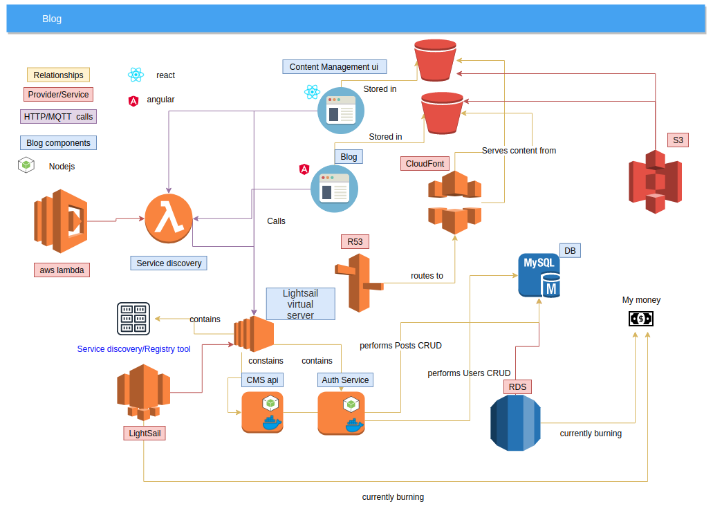

# Pvoltaire

This is a simple multi-user blog/cms using Nestjs angular and react

I'm currently using multiple service from the aws stack such as:
* Lambda for calls to the consul endpoint to know the location of other services
* Lightsail to host my servers :(It was a cheap way to get the project started and i can always upgrade to ECS later)
* RDS for user and post data persistence: I wanted to avoid a NoSQL db
    * The data structure is mostly consistent
     * i wanted to avoid redundancy
     * it's easier for organizing and visualizing data
 * I may add Dynamo or something else if i start dealing with data from unstructured sources 
 * S3 for static site hosting
 * r53 and Cloudfont as DNS service and cdn 
      
The architecture right now, is a bit of a mess, so it is subject to change

---

##Features
* User login/sign up
    * basic
    * social media
* Content management and creation
* Post templates creation and selection
* Post versioning : Draft/updates
* Comments

##link
http://despairdrivendevelopment.net/

---
This project was generated using [Nx](https://nx.dev).

🔎 **Nx is a set of Extensible Dev Tools for Monorepos.**

## Quick Start & Documentation

[Nx Documentation](https://nx.dev/angular)

[10-minute video showing all Nx features](https://nx.dev/angular/getting-started/what-is-nx)

[Interactive Tutorial](https://nx.dev/angular/tutorial/01-create-application)

## Adding capabilities to your workspace

Nx supports many plugins which add capabilities for developing different types of applications and different tools.

These capabilities include generating applications, libraries, etc as well as the devtools to test, and build projects as well.

Below are some plugins which you can add to your workspace:

- [Angular](https://angular.io)
  - `ng add @nrwl/angular`
- [React](https://reactjs.org)
  - `ng add @nrwl/react`
- Web (no framework frontends)
  - `ng add @nrwl/web`
- [Nest](https://nestjs.com)
  - `ng add @nrwl/nest`
- [Express](https://expressjs.com)
  - `ng add @nrwl/express`
- [Node](https://nodejs.org)
  - `ng add @nrwl/node`

## Generate an application

Run `ng g @nrwl/angular:app my-app` to generate an application.

> You can use any of the plugins above to generate applications as well.

When using Nx, you can create multiple applications and libraries in the same workspace.

## Generate a library

Run `ng g @nrwl/angular:lib my-lib` to generate a library.

> You can also use any of the plugins above to generate libraries as well.

Libraries are sharable across libraries and applications. They can be imported from `@pvoltaire/mylib`.

## Development server

Run `ng serve my-app` for a dev server. Navigate to http://localhost:4200/. The app will automatically reload if you change any of the source files.

## Code scaffolding

Run `ng g component my-component --project=my-app` to generate a new component.

## Build

Run `ng build my-app` to build the project. The build artifacts will be stored in the `dist/` directory. Use the `--prod` flag for a production build.

## Running unit tests

Run `ng test my-app` to execute the unit tests via [Jest](https://jestjs.io).

Run `nx affected:test` to execute the unit tests affected by a change.

## Running end-to-end tests

Run `ng e2e my-app` to execute the end-to-end tests via [Cypress](https://www.cypress.io).

Run `nx affected:e2e` to execute the end-to-end tests affected by a change.

## Understand your workspace

Run `nx dep-graph` to see a diagram of the dependencies of your projects.

## Further help

Visit the [Nx Documentation](https://nx.dev/angular) to learn more.
